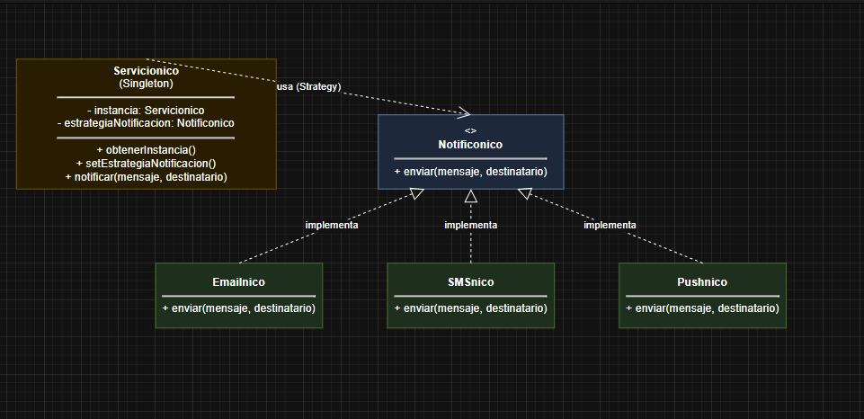
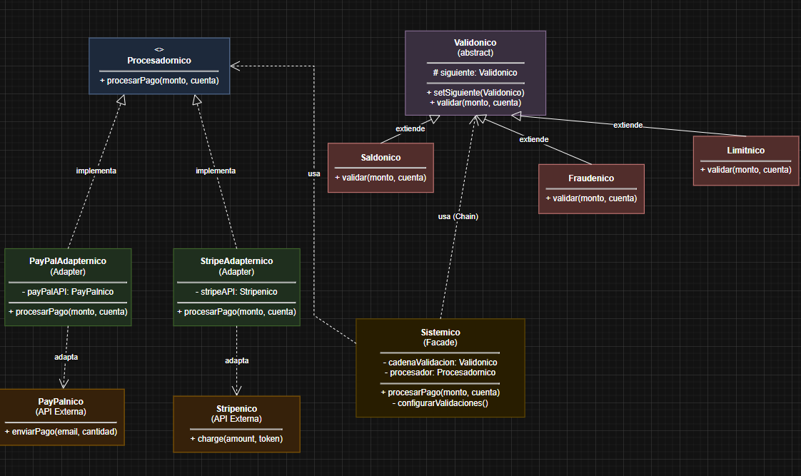

# Refuerzo de Patrones de Diseno - Nico

Bueno, aca esta el refuerzo de patrones de diseno. La idea era combinar varios patrones dentro de un mismo sistema para ver como funcionan juntos y como ayudan a resolver problemas reales.

## Ejercicio 1: Sistema de Notificaciones

### Que patrones use?

**Singleton**  
La idea aca es que el servicio de notificaciones sea unico. No importa cuantas veces se llame, siempre se usa la misma instancia. Asi evitas tener varios servicios duplicados y todo queda mas centralizado.

**Strategy**  
Este patron permite cambiar la forma de enviar la notificacion sin tener que modificar el servicio principal. Tenes diferentes clases como Emailnico, SMSnico y Pushnico, y cada una sabe como enviar su tipo de notificacion. Si mas adelante quisieras agregar, por ejemplo, notificaciones por Telegram, solo tendrias que crear otra clase y listo.

### Las clases

- `Notificonico` - Interfaz que define como se envia una notificacion
- `Emailnico`, `SMSnico`, `Pushnico` - Las diferentes formas de enviar notificaciones
- `Servicionico` - El servicio unico que maneja todo
- `ServicionicoTest` - Pruebas para verificar que todo funcione

---

## Ejercicio 2: Sistema de Procesamiento de Pagos

### Que patrones use?

**Adapter**  
Cada proveedor de pago funciona de forma diferente. Por ejemplo, PayPal tiene un metodo `enviarPago()` y Stripe usa `charge()`. Los adapters (PayPalAdapternico y StripeAdapternico) se encargan de traducir esos metodos a una interfaz comun que nuestro sistema pueda usar.

**Chain of Responsibility**  
Las validaciones se hacen en cadena. Primero se revisa el saldo (Saldonico), despues se revisa posible fraude (Fraudenico) y al final se revisa el limite (Limitnico). Si alguna validacion falla, el proceso se detiene y el pago no se realiza. Si todas pasan, entonces el pago continua. Lo bueno es que se pueden agregar o quitar validaciones sin afectar mucho el sistema.

**Facade**  
El Sistemico funciona como una capa que simplifica todo el proceso. Desde afuera solo se llama al metodo `procesarPago()` y el sistema se encarga internamente de ejecutar las validaciones y procesar el pago. Asi no hace falta conocer todos los detalles de como funciona por dentro.

### Las clases

- `Procesadornico` - Interfaz comun para todos los procesadores de pago
- `PayPalnico`, `Stripenico` - APIs externas de los proveedores
- `PayPalAdapternico`, `StripeAdapternico` - Adaptadores que conectan las APIs con el sistema
- `Validonico` - Clase base para la cadena de validaciones
- `Saldonico`, `Fraudenico`, `Limitnico` - Validaciones especificas
- `Sistemico` - Clase que coordina todo el proceso
- `SistemicopTest` - Pruebas del sistema

---

## Diagramas UML

### Ejercicio 1 - Sistema de Notificaciones

### Ejercicio 2 - Sistema de Procesamiento de Pagos

